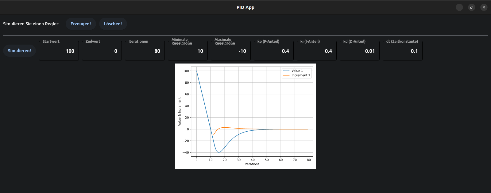

# PID Regler App

The App for PID Controler simulation.

To run the app install `flet` module:

```bash
pip install flet
```

and run the program:

```bash
python flet_app.py
```

The app will be started in a native OS window:



If you want to run the app as a web app, just replace the last line in flet_app.py with:

```python
flet.app(target=main, view=flet.WEB_BROWSER)
```

run again and now you instantly get a web app.

Thanks to: [Flet](https://github.com/flet-dev/flet)